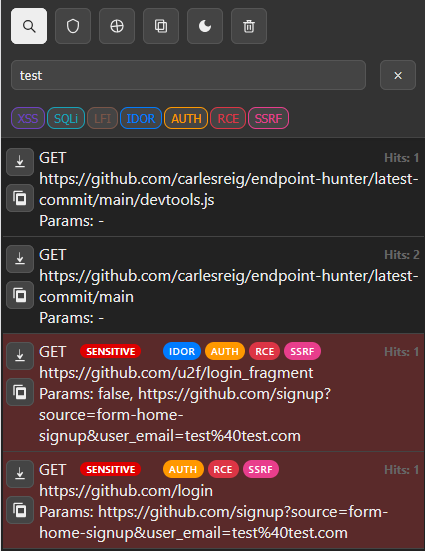
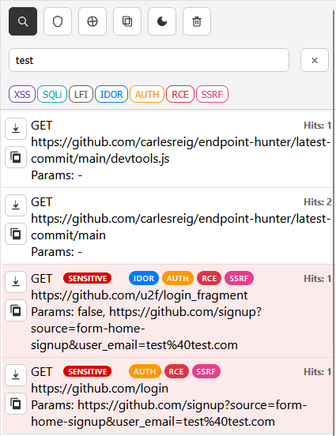
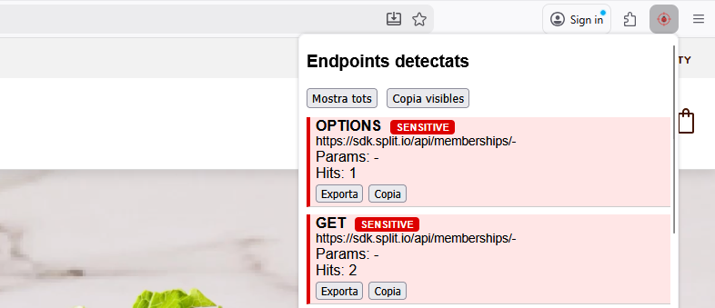
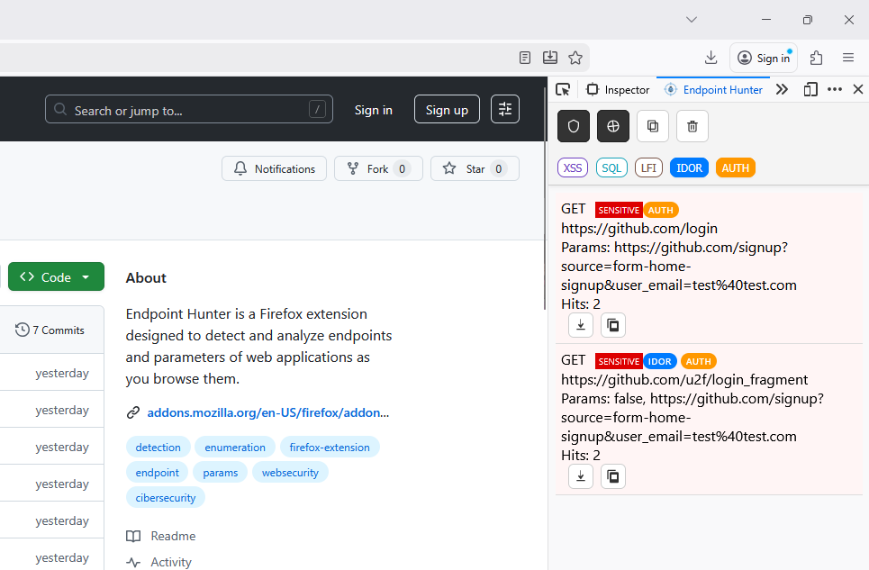
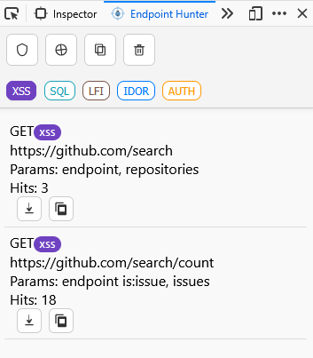
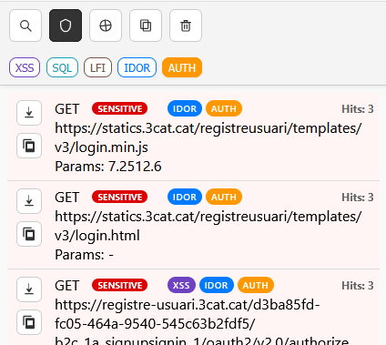
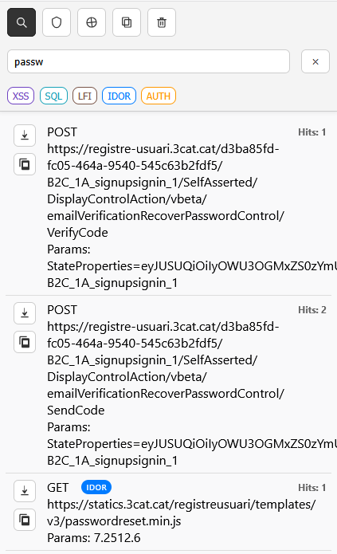
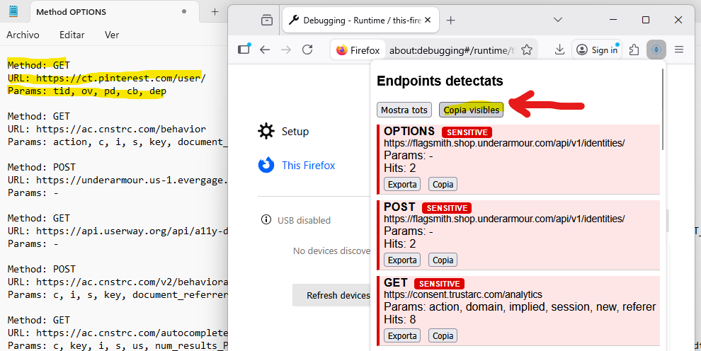

# Endpoint Hunter 🕵️‍♂️

**Endpoint Hunter** és una extensió per a Firefox dissenyada per detectar i analitzar endpoints i paràmetres d’aplicacions web mentre navegues per elles. Només has d'anar a la pàgina web i activar l'extensió, veuràs que apareixen endpoints de forma automàtica, els podràs filtrar amb el cercador o les etiquetes inteligents i exportar-ho amb un sol clic.

Està pensada com a eina d’ajuda per a:
- 🔒 Pentesting autoritzat
- 🐞 Bug bounty
- 🛡️ Formació en seguretat web
- 🌐 Anàlisi d’aplicacions web modernes

---

## 🚀 Funcionalitats

- 🖥️ Interfície integrada en navegador, no intrusiva
- 🪶 Lleuger, no afecta al rendiment del navegador web
- 🎁 Detecció automàtica d’endpoints GET i POST
- 🚩 Identificació d’endpoints potencialment sensibles
- 🎯 Filtre per mostrar només endpoints sensibles i/o del mateix domini
- 🏷️ Etiquetes automàtiques en endpoints, filtratge de resultats
- 🔍 Cercador d'endpoints detectats per concepte i paràmetres
- 📋 Còpia d’un endpoint individual
- 📋 Còpia de tots els endpoints visibles
- 📤 Exportació d’endpoints en format JSON
- 📊 Comptador de hits per endpoint

---

## 🧪 Exemples d’ús

- Identificar rutes ocultes en aplicacions SPA
- Detectar formularis de login o endpoints d’autenticació
- Analitzar paràmetres interessants per testing manual
- Enumeració d'enllaços amagats (rutes) i mètodes HTTP
- Preparar endpoints per importar-los a Burp o altres eines per detectar vulnerabilitats com Dalfox o Nuclei

---

## ⚠️ Disclaimer

> Aquesta extensió està pensada **únicament** per a finalitats educatives i per a proves de seguretat **autoritzades**.
>
> L’ús d’aquesta eina contra aplicacions sense permís explícit pot ser il·legal.
> L’autor no es fa responsable de l’ús indegut del programari.

---

## Captures de pantalla

### Dark mode
 

### Endpoints detectats amb informació sensible


### Endpoints detectats amb info sensible i del mateix domini


### Filtres d'endpoints segons possible vulnerabilitat
 

### Cercant conceptes en endpoints trobats


### Exportant al portaretalls del sistema


## 🛠 Instal·lació (desenvolupament)

1. Clona el repositori:
   ```bash
   git clone https://github.com/carlesreig/endpoint-hunter.git

2. Obre Firefox i ves a:
    ```bash
    about:debugging#/runtime/this-firefox

3. Carrega  `manifest.json`

4. Prem <kbd>F12</kbd> o bé <kbd>Ctrl</kbd>+<kbd>Shift</kbd>+<kbd>I</kbd> `Developer Tools` i selecciona l'extensió "Endpoint Hunter".

## 🤝 Contribucions

Les contribucions són benvingudes!
Obre un Issue per bugs o propostes.
Fes un Pull Request per noves funcionalitats.
Marca els canvis de manera clara.

## 📄 Llicència

[Mozilla Public License Version 2.0](https://www.mozilla.org/en-US/MPL/2.0/) (MPL 2.0)
